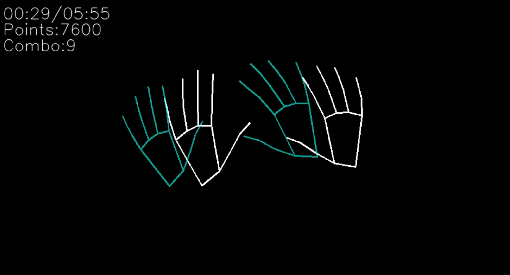

# cv-rhythm-game
A rhythm game that utilizes computer vision hand recognition.

This is an in-progress prototype of a rhythm game where the player must match their hands to the hands on screen. They can also create their own custom levels.

A Windows installer can be found on my [itch page](https://pseudosodasi.itch.io/hand-dance).

I used Pygame to incorporate game elements and MediaPipe and OpenCV to track hand movements.
# Requirements
- Pygame <= 2.1.2
- MediaPipe <= 0.8.1
- OpenCV <= 3.4.2
